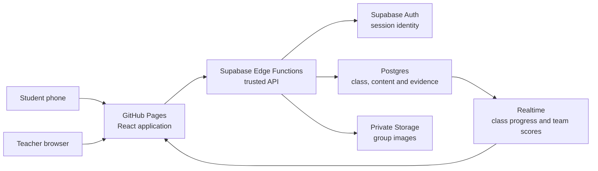

# Future-Ready Campus Quest: Technical Development Design

**Status:** Draft for technical review
**Date:** 30 July 2026
**Scale:** One teacher, approximately 30 concurrent students, five default groups
**Hosting decision:** GitHub Pages frontend with Supabase backend

## 1. Architecture decision

The application uses a static mobile-first frontend on GitHub Pages and a trusted Supabase backend.

GitHub Pages serves HTML, CSS, JavaScript, fonts, and original decorative assets. GitHub describes Pages as static site hosting, so it will not contain protected learning content, answer keys, privileged logic, service credentials, or learner data. Supabase provides authentication sessions, Postgres, private Storage, Realtime, Row Level Security (RLS), and Edge Functions.

Official references:

- [GitHub Pages is static hosting](https://docs.github.com/en/pages/getting-started-with-github-pages/what-is-github-pages)
- [GitHub Pages custom deployment workflows](https://docs.github.com/en/pages/getting-started-with-github-pages/using-custom-workflows-with-github-pages)
- [Supabase Auth](https://supabase.com/docs/guides/auth)
- [Supabase Row Level Security](https://supabase.com/docs/guides/database/postgres/row-level-security)
- [Supabase Edge Functions](https://supabase.com/docs/guides/functions)



## 2. Technology baseline

Use stable supported releases and commit the exact resolved dependency versions in `pnpm-lock.yaml`.

| Area | Baseline |
|---|---|
| Runtime | Node.js 24 LTS |
| Package manager | pnpm |
| UI | React 19.2 with TypeScript 6.0 |
| Build | Vite 8.1 |
| Animation | Motion 12; import from `motion/react` |
| Backend client | `@supabase/supabase-js` 2 |
| Backend runtime | Supabase Edge Functions using TypeScript/Deno |
| Unit/component testing | Vitest and React Testing Library |
| Browser testing | Playwright 1.62 |
| Database policy testing | Supabase CLI plus pgTAP/SQL assertions |
| Deployment | GitHub Actions to GitHub Pages; separate protected workflow for Supabase migrations/functions |

The baselines reflect the current official supported releases as of this design:

- [React 19.2](https://react.dev/versions)
- [Vite 8.1 support line](https://vite.dev/releases)
- [TypeScript 6.0](https://www.typescriptlang.org/docs/handbook/release-notes/typescript-6-0.html)
- [Node.js 24 LTS](https://nodejs.org/en/about/previous-releases)
- [Motion for React](https://motion.dev/docs/react)
- [supabase-js 2](https://supabase.com/docs/reference/javascript/installing)
- [Playwright release notes](https://playwright.dev/docs/release-notes)

Do not add a charting, global-state, component-library, or offline-framework dependency unless a tested requirement cannot be met with React, semantic HTML, CSS, and the Supabase client.

## 3. Repository and deployment boundaries

### 3.1 Public repository contents

The repository may contain:

- Frontend source.
- Original design assets created for Campus Quest.
- Database migrations and RLS policies.
- Edge Function source without secrets.
- Tests and synthetic fixtures.
- Schemas for importing content.
- Documentation.

The repository must not contain:

- The two source PDFs.
- PDF screenshots or extracted media.
- The production question bank, feedback, or answer keys.
- Real cohort, learner, or teacher data.
- Supabase service-role keys, access tokens, private URLs, or environment files.

### 3.2 Client-visible configuration

Only these values may be compiled into the GitHub Pages artifact:

- `VITE_SUPABASE_URL`
- `VITE_SUPABASE_PUBLISHABLE_KEY`
- Public application base path
- Non-secret release identifier

The Supabase publishable key is designed for client use, but all exposed tables still require grants and RLS.

### 3.3 Privileged configuration

Store privileged values in Supabase Edge Function secrets:

- `SUPABASE_SERVICE_ROLE_KEY`
- Allowed frontend origins
- Content-import signing secret
- Export signing secret, if used

Never place the service-role key in GitHub Pages variables, frontend source, browser storage, logs, or test snapshots.

### 3.4 Routing

Use hash-based client routing so direct navigation works under a GitHub Pages project path without custom server rewrites. Example routes:

- `/#/join`
- `/#/quest`
- `/#/results`
- `/#/teacher`
- `/#/teacher/cohorts/:cohortId`

## 4. No-email, no-password, no-PIN student session design

### 4.1 Join window

1. The teacher opens a cohort for joining.
2. The backend creates a high-entropy, time-limited cohort join token.
3. The teacher displays one shared class QR code and link.
4. The token is carried in the URL fragment, which is not sent as an HTTP referrer; the client removes it from the visible URL and memory after session creation.
5. The default join window is 15 minutes and can be closed immediately by the teacher.

### 4.2 Student enrolment

The student:

1. Opens the shared link.
2. Selects the teacher-assigned group number.
3. Enters a real name and optional nickname.
4. Confirms the class-only privacy notice.
5. Submits the join form.

The `join-cohort` Edge Function:

1. Detects a completed idempotent replay or validates the join token, cohort state, origin, group capacity, and request rate through one trusted preparation RPC.
2. Normalises and validates names.
3. Creates a synthetic internal email identity and one-time magic-link hash in one Admin API request; no email is sent and no student password is created.
4. Uses a separate unprivileged Supabase Auth client inside the function to exchange that hash for a standard access/refresh session.
5. Exchanges the session and creates the learner profile and group membership transactionally in parallel after the protected preflight succeeds.
6. Returns the session to the requesting browser over HTTPS, where the frontend calls the standard Supabase session setter.
7. Assigns the first joined member as the temporary group-identity editor; the teacher or current editor can transfer that role.
8. Deletes or disables the Auth identity if the database transaction fails.
9. Records an audit event without logging the real name.

The internal identity is never shown to the learner. The client stores the Supabase session using the standard client session mechanism.

### 4.3 Session recovery

If a student loses the device session:

1. The teacher selects the student in the private dashboard and chooses **Reset session**.
2. The backend revokes existing refresh tokens.
3. The dashboard generates a student-specific, single-use recovery QR link valid for five minutes.
4. The student scans the link and resumes the same profile and progress.

The teacher does not see or distribute a password or PIN.

### 4.4 Teacher authentication

Teacher accounts are manually provisioned and use a normal verified email identity with a strong password or institutional OAuth. Teacher authorisation is stored in a protected role table. Browser route checks and trusted teacher actions read that authoritative database role; token metadata is not treated as an authorisation decision.

## 5. Data model

Use UUID primary keys, `timestamptz` timestamps, foreign keys, check constraints, and indexes on every policy/filter column.

### 5.1 Public application schema

Tables exposed through the Data API still use least-privilege grants and RLS.

| Table | Purpose | Key fields |
|---|---|---|
| `cohorts` | One class run | `id`, `title`, `status`, `join_open_until`, `rankings_visible`, `paused_at` |
| `groups` | Immutable numbered group plus editable identity | `id`, `cohort_id`, `group_number`, `display_name`, `image_path`, `capacity`, `identity_locked`, `identity_editor_profile_id` |
| `profiles` | Private learner identity and membership | `id`, `auth_user_id`, `cohort_id`, `group_id`, `real_name`, `nickname`, `status` |
| `attempts` | Diagnostic, mission, final, or retry run | `id`, `profile_id`, `phase`, `started_at`, `submitted_at`, `status` |
| `question_instances` | A delivered version assigned to a learner | `id`, `attempt_id`, `question_version_id`, `concept_id`, `sequence`, `support_state` |
| `responses` | Immutable first submission and later retry | `id`, `instance_id`, `profile_id`, `answer_json`, `correct`, `misconception_code`, `confidence`, `submitted_at`, `request_key` |
| `concept_mastery` | Current routed estimate and evidence counters | `profile_id`, `concept_id`, `mastery_value`, `support_state`, `updated_at` |
| `reflections` | Final learner takeaway | `profile_id`, `attempt_id`, `body`, `submitted_at` |
| `team_score_snapshots` | Approved aggregate for leaderboard | `cohort_id`, `group_id`, `score`, `completion`, `calculated_at` |
| `audit_events` | Teacher controls and sensitive changes | `id`, `actor_user_id`, `cohort_id`, `event_type`, `entity_id`, `created_at` |

### 5.2 Private content schema

The `content` schema is not exposed to browser roles.

| Table | Purpose |
|---|---|
| `content.concepts` | C1-C8 definitions and source metadata |
| `content.questions` | Stable item identities |
| `content.question_versions` | Stem, options, interaction payload, difficulty, timing, review status |
| `content.answer_keys` | Correct response, scoring rules, rationales, misconception mappings |
| `content.source_refs` | Local source identifier and page range |
| `content.mission_templates` | Scenario framing and cross-concept combinations |

Only trusted Edge Functions may read answer keys.

### 5.3 Private system schema

The `private` schema is not exposed to browser roles.

| Table | Purpose |
|---|---|
| `private.join_tokens` | Hash, cohort scope, expiry, and consumption state for shared join links |
| `private.session_recovery_tokens` | Hash, profile scope, expiry, teacher authorisation, and single-use state |

### 5.4 Storage

Create a private bucket `group-images`.

Object path:

`<cohort-id>/<group-id>/<asset-id>.webp`

Policy:

- Students may request upload/fetch access only for their own group while edits are unlocked.
- All cohort members may view approved group images in their cohort.
- Teachers may view, replace, reject, or delete any image in their cohort.
- Cross-cohort access is denied.
- Signed read URLs expire after ten minutes.

## 6. RLS policy matrix

| Resource | Student | Teacher |
|---|---|---|
| Own profile | Read limited fields; update nickname only | Read and manage all profiles in own cohort |
| Peer profile | Read nickname and group membership only within own group | Read all within own cohort |
| Group | Read cohort groups; update own group's identity only while unlocked | Full cohort management |
| Attempts/responses | Read own; mutation only through trusted function | Read cohort results |
| Mastery | Read own | Read cohort |
| Team score | Read cohort aggregate when rankings visible | Always read cohort aggregate |
| Audit events | No access | Read own cohort |
| Content/answers | No direct access | No direct browser access; reviewed delivery through functions |

Policies must explicitly check:

- Authenticated session.
- Cohort membership.
- Group membership when required.
- Teacher role from protected metadata/table.
- Join/edit/status flags.

RLS tests must include cross-student, cross-group, cross-cohort, anonymous, and forged-metadata attempts.

## 7. Edge Function interfaces

All mutating endpoints accept a client-generated `requestKey` and are idempotent.

### `join-cohort`

**Input:** join token, group number, real name, optional nickname, privacy confirmation
**Output:** session, profile summary, group summary
**Guards:** join window, group capacity, input length, rate limit, duplicate submission

### `resume-student`

**Input:** one-time teacher-generated recovery token
**Output:** replacement session and current journey state
**Guards:** token expiry, single use, teacher-authorised reset

### `get-journey`

**Input:** authenticated session
**Output:** current phase, timer guidance, completed instances, next available action
**Guards:** own profile only

### `get-next-item`

**Input:** attempt ID
**Output:** question instance without answer key, support content allowed for that phase
**Guards:** phase rules, sequence, cohort pause state

### `submit-response`

**Input:** instance ID, answer payload, confidence, request key
**Output:** correctness when phase permits, misconception code, feedback, mastery summary
**Guards:** payload schema, ownership, phase state, prior submission, server-side scoring

### `finalize-assessment`

**Input:** final attempt ID and request key
**Output:** final results, explanations, retry concept, individual contribution summary
**Guards:** all required instances submitted; single finalisation transaction

### `submit-reflection`

**Input:** attempt ID, reflection text, request key
**Output:** completion receipt
**Guards:** 20-240 characters after trimming; no score based on sentiment or quality

### `update-group-identity`

**Input:** group name or staged image asset ID
**Output:** moderated group summary
**Guards:** membership, temporary editor role, edit lock, content length, MIME/magic bytes, image dimensions, capacity

### `teacher-control`

**Input:** cohort ID, action, action-specific payload
**Output:** updated state and audit receipt
**Actions:** open/close joining, lock roster, transfer group editor, lock identity, pause/resume, show/hide rankings, reset session, remove image

### `dashboard-summary`

**Input:** cohort ID and filters
**Output:** authorised aggregate plus optional private drill-down
**Guards:** teacher role and cohort ownership

### `export-results`

**Input:** cohort ID
**Output:** short-lived signed CSV download
**Guards:** teacher role; exclude item content and answer keys

## 8. Adaptive and scoring logic

### 8.1 Diagnostic routing

For each concept:

- Incorrect answer → `needs_support`.
- Correct plus low confidence → `needs_support`.
- Correct plus medium confidence → `developing`.
- Correct plus high confidence → `secure`.
- Incorrect plus high confidence receives the highest misconception priority.

### 8.2 Mission scheduler

The scheduler assigns approximately six mission items:

1. Two items from the highest-priority weak concepts.
2. Two cross-concept scenarios spanning policy/e-Pedagogy and 21QL.
3. One secure-concept transfer challenge.
4. One synthesis mission involving a classroom redesign.

If fewer than six items fit the remaining time, synthesis and weak-concept practice take priority. The final assessment should begin by elapsed minute 21.

### 8.3 Mastery estimate

Use a transparent deterministic model, not machine learning:

- Diagnostic establishes support state.
- Practice evidence updates the estimate, with unassisted evidence weighted above hinted evidence.
- Final first-attempt evidence carries the greatest weight.
- Retry evidence is stored separately and may raise the displayed learning status without overwriting first-attempt analytics.

The teacher dashboard labels this value **mastery estimate**, not mastery fact.

### 8.4 Individual contribution

Let:

- `F = final_correct / 8 * 100`
- If `diagnostic_correct < 8`, `I = max(0, final_correct - diagnostic_correct) / (8 - diagnostic_correct) * 100`
- If `diagnostic_correct = 8` and `final_correct = 8`, `I = 100`; otherwise `I = 0`
- `M = required_missions_completed / required_missions_assigned * 100`
- `R = 100` when the valid reflection is submitted, otherwise `0`

Then:

`individual_contribution = 0.60F + 0.25I + 0.10M + 0.05R`

### 8.5 Team score

`team_score = average(individual_contribution for eligible joined members)`

Rules:

- Team size does not multiply score.
- Time does not enter any formula.
- A student becomes eligible after submitting the diagnostic.
- The public score includes a timestamp and an updating state.
- Ties share rank.
- The teacher may keep ranks hidden until the final challenge closes.

## 9. Frontend structure

Organise by feature, not by technical layer:

```text
src/
  app/
    App.tsx
    router.tsx
    providers.tsx
  features/
    join/
    quest/
    assessment/
    groups/
    leaderboard/
    teacher/
  shared/
    api/
    components/
    motion/
    storage/
    styles/
    types/
  content-shell/
    campus-map/
    guide-character/
    badges/
```

Boundaries:

- Feature folders own screens, state transitions, and tests for one capability.
- `shared/api` contains typed Edge Function clients and no UI.
- `shared/motion` defines reusable motion tokens and reduced-motion replacements.
- `shared/storage` owns the small pending-submission queue.
- No component reads Supabase tables directly unless the technical design explicitly permits that resource through RLS.

## 10. Campus Quest design system

### Tokens

- Deep navy for primary text and outlines.
- Violet for progress and primary actions.
- Coral/orange for missions.
- Teal/green for success and movement.
- Warm yellow for celebration and hints.
- Off-white surfaces for reading.

### Components

- Campus map and territory node.
- Mission card.
- Guide-character message.
- Scenario decision card.
- Confidence selector.
- Concept-link feedback card.
- Team identity card.
- Progress path.
- Badge celebration.
- Teacher metric, heatmap, question-analysis row, and control bar.

### Motion

Use Motion for spring cards, presence transitions, map movement, and layout updates. Use CSS for simple colour and opacity transitions. Wrap the app in a reduced-motion configuration; never rely on motion to communicate state.

## 11. Image handling

1. Accept JPEG, PNG, and WebP.
2. Reject files above 5 MB before processing.
3. Decode in the browser and resize with canvas to fit within 1200 x 1200.
4. Export WebP targeting approximately 1 MB.
5. Obtain a short-lived upload authorisation for the learner's group.
6. Validate server-side MIME metadata, file signature, size, path, membership, and edit state.
7. Mark the asset pending until the upload is confirmed.
8. Allow teacher rejection/deletion.
9. Strip original filenames and avoid storing EXIF metadata by re-encoding.

The app must always provide a generated group avatar so photo upload is optional.

## 12. Resilience and offline behaviour

The app is online-first.

- Cache only the public application shell and original decorative assets.
- Do not service-worker-cache protected API responses or signed image URLs.
- Prefetch the next small set of assigned question payloads without answer keys.
- Store unsynchronised responses in IndexedDB using opaque IDs and no real names.
- Each queued response includes a request key and submission timestamp.
- Retry with bounded exponential backoff.
- Clear queued data after server acknowledgement or cohort retention expiry.
- A final submission is complete only after the server returns a receipt.

If the connection remains unavailable, the learner can continue through prefetched items and sees **Waiting to sync**. The teacher dashboard distinguishes pending from unanswered work.

## 13. Security and privacy

### Application security

- RLS enabled on every exposed table.
- Default deny for unauthenticated requests.
- Service-role operations restricted to Edge Functions.
- Strict CORS allowlist for production and local development.
- Content Security Policy allowing only required GitHub Pages and Supabase origins.
- No inline secrets or privileged keys.
- Schema validation on all function inputs and outputs.
- Parameterised database access.
- Rate limiting on joining, session reset, uploads, and submissions.
- Join token entropy of at least 128 bits and short expiry.
- Audit records for teacher controls and identity changes.
- No real names or answer payloads in application logs.

### Data minimisation

Collect:

- Real name for teacher identification.
- Optional nickname.
- Group membership and group identity.
- Learning responses, confidence, timing, mastery estimates, and reflection.

Do not collect:

- Student email, phone, institutional identifier, date of birth, location, or contacts.
- Biometric analysis of uploaded photos.
- Advertising or cross-site tracking data.

### Retention

- Default cohort retention is 90 days after the class session.
- The teacher may export results before deletion.
- Deleting a cohort removes profiles, responses, reflections, audit references where permitted, and group images.
- Aggregated de-identified analytics may be retained only if institutional policy permits.

## 14. Supabase free-tier operation

Thirty learners are well below the current Free-plan allowances, including 50,000 monthly active users, 500 MB database size, 500,000 Edge Function invocations, two million Realtime messages, and 200 peak Realtime connections. [Supabase billing documentation](https://supabase.com/docs/guides/platform/billing-on-supabase)

Operational caveats:

- Free projects may pause after low activity. The teacher must open the project and run readiness checks at least 24 hours before class. [Project pausing](https://supabase.com/docs/guides/platform/free-project-pausing)
- If the project is paused, the teacher must resume it in the Supabase dashboard before the in-app readiness check can pass.
- Free projects do not provide production uptime guarantees or downloadable automatic backups.
- The system must expose a plain-language health failure rather than allowing a class to begin with an unavailable backend.
- Upgrade to Pro before the module becomes operationally critical or is used across multiple regular cohorts.

## 15. Teacher readiness check

The teacher dashboard provides a preflight screen:

- Backend reachable.
- Auth and Edge Functions responding.
- C1-C8 content coverage complete.
- Diagnostic and final forms contain eight approved items each.
- Group count and capacity total at least 30.
- Join window closed before readiness.
- Image bucket and policies available.
- Realtime update test passed.
- Current deployed frontend and backend release IDs compatible.
- Synthetic 30-student load test passed for the release.

The screen produces a dated readiness receipt.

## 16. Testing strategy

### Unit tests

- Diagnostic support-state classification.
- Mission priority ordering.
- Normalised improvement calculation, including perfect-baseline edge case.
- Individual and team scoring.
- Tie ranking.
- Timer-based mission trimming.
- Name validation and group capacity.
- Image dimension and size rules.
- Retry evidence preservation.

### Component tests

- Join flow at 360 px.
- Scenario interaction using touch, mouse, and keyboard.
- Ordering using accessible controls.
- Confidence selector.
- Feedback with and without motion.
- Group identity upload states.
- Leaderboard privacy.
- Teacher concept heatmap and question filters.

### Database and policy tests

- A student cannot read another student's private profile.
- A student can read only permitted peer nickname/group data.
- A student cannot access another cohort.
- A student cannot read content answer keys.
- A student cannot update a locked group.
- A teacher can access only owned cohorts.
- Forged user metadata does not grant teacher access.
- Signed image paths cannot cross cohort boundaries.

### Edge Function tests

- Join token expiration and single cohort scope.
- Concurrent final seat claims do not exceed group capacity.
- Duplicate submission returns the original result.
- Scoring rejects malformed payloads and unsupported item versions.
- Finalisation is transactional.
- Recovery link is single use.
- Export excludes answer keys.

### End-to-end tests

- Complete student journey under 30 minutes using deterministic clocks.
- Thirty concurrent students distributed across five groups.
- Diagnostic routes to all three support states.
- Network interruption, queued response, and recovery.
- Refresh and session resume.
- Teacher pause/resume and ranking visibility.
- Group image upload, moderation, and deletion.
- Teacher identifies a seeded class misconception.
- GitHub Pages project-path routing.

### Accessibility and performance

- Automated axe checks on every primary route.
- Keyboard-only journey.
- 200% browser zoom.
- Reduced-motion journey.
- Screen-reader labels for progress, feedback, ordering, and heatmap data.
- Lighthouse mobile performance run on the production build.
- Performance budget: initial compressed JavaScript under 250 KB where practical, no decorative image above 250 KB, and interactive within three seconds on a representative mid-range phone over classroom Wi-Fi.

## 17. CI/CD

### Pull-request checks

- Type checking.
- Linting and formatting.
- Unit/component tests.
- Production build.
- SQL/RLS tests against local Supabase.
- Playwright smoke journey.
- Dependency and secret scanning.
- Check that banned source PDF filenames and production content files are absent from the commit.

### Frontend deployment

On an approved main-branch change:

1. Build with the GitHub Pages base path.
2. Run the production smoke test.
3. Upload the Pages artifact.
4. Deploy using the protected `github-pages` environment.
5. Record the release identifier.

### Backend deployment

Use a separate manually approved workflow:

1. Validate migrations.
2. Run policy tests.
3. Deploy migrations and Edge Functions.
4. Run backend health checks.
5. Record the compatible backend release identifier.

Protected course content is imported after backend deployment through a teacher-authorised tool and is never a GitHub Actions artifact.

## 18. Monitoring and audit

- Edge Function logs include request ID, function, latency, status, and pseudonymous actor ID.
- Logs exclude real name, nickname, reflection, answer payload, and group image URL.
- Dashboard health includes last successful Realtime update and last scoring receipt.
- Audit events record teacher controls, roster locks, image removal, session resets, exports, and cohort deletion.
- Error messages shown to students use recoverable actions and a short support code.

## 19. Technical acceptance criteria

The system is technically acceptable when:

- The GitHub Pages artifact contains no protected content, answer keys, PDFs, or privileged secrets.
- A shared time-limited join link enrols 30 students without email, password, or PIN entry.
- Concurrent joins enforce group capacities transactionally.
- Students cannot cross profile, group-private, or cohort boundaries.
- Answer keys remain accessible only to trusted scoring code.
- All submissions are idempotent and preserve first-attempt evidence.
- Team scoring matches the approved formula and excludes time.
- Group images are re-encoded, private, class-scoped, and teacher-moderated.
- The teacher dashboard reports C1-C8, question, misconception, group, and individual evidence.
- Refresh, reconnect, pause, and session reset paths are verified.
- Mobile, keyboard, screen-reader, zoom, contrast, and reduced-motion tests pass.
- The 30-user synthetic run completes without quota, concurrency, or data-isolation failures.
